<h1>
  
  The Singularity Camper Control System
</h1>

The SCCS is a control system for the electrics in your caravan or camper trailer. It replaces a switch panel and battery/water gauges etc. with a modern touchscreen UI that provides:
- Automated control of lighting based on sunset/sunrise times and door/panel open and closes.
- Display of important information:
  - Battery level and usage
  - Solar generation
  - Water tank levels
  - Location data
  - outside/fridge temperature and weather forecasts
  - Sonos speakers

The system is made up of a Raspberry Pi and custom PCB, the SCCS Core that is the central hub where all field wiring connects to.

The SCCS software configures the Raspberry Pi as a router so that Internet can be distributed from a USB/Wi-Fi hotspot or Starlink through a downstream WAP, enabling a local Wi-Fi network that gives your devices access to the UI and provides ad-filtered Internet access.

Networking services - NAT, DNS, DHCP and ad-filtering are provided by nftables and Pi-Hole, which are automatically configured during installation. Instructions are provided for installing the UniFi OS server for management of UniFi WAP points if desired. Apple HomeKit and Google Home can be configured to enable voice commands of lighting through Siri or Gemini. Cloudflare Tunnels is supported for remote access to the system while away from the caravan/camper.

An interactive demo is available at [demo.singularityautomation.com.au](https://demo.singularityautomation.com.au).

## Getting started

## Quickstart

1. Order SCCS Core PCB from JLCPCB by uploading the contents of the `/kicad/production` folder to JLCPCB. Get PCBA (assembly) done as well - you will receive a warning during the component placement stage that the same component is mapped to multiple parts. This is intentional, tick the checkboxes to include them in the build and continue.
2. Install wiring and SCCS core.
3. Install the software with the install command:

```bash
curl -fsSL https://raw.githubusercontent.com/muntedpissmole/sccs/main/install.sh -o /tmp/sccs-install.sh && sudo bash /tmp/sccs-install.sh
```

Full instructions are in the [project wiki](https://github.com/muntedpissmole/sccs/wiki/).

## System overview

A touchscreen in the kitchen or similar area shows the main user interface and is also reachable from phones or tablets on the LAN:

- Dimmable lighting sliders with red/white anti-bug mode and on/off buttons for non-dimmable loads (water, lighting, fridge circuits)
- Ambient lights that fade on as it gets dark
- One-touch lighting scenes
- Control of Sonos speakers
- Light/dark UI themes and an extensive settings page
- Integration with Apple HomeKit and Google Home

## Display of Environmental information

- Water tank level
- Current temperature and fridge/freezer temperatures
- Current battery charge, voltage, current consumption, estimated power remaining and current/daily solar generation
- GPS coordinates, closest suburb, altitude, satellite quality, sunrise/sunset, and the day/evening/night timing that drives automation
- 4 Day weather forecast, humidity and expected overnight temperature if Internet is present
- Internet connection quality details
- What lights are on and what doors or panels are open
- Health status of connected hardware modules like solar or GPS

## Hardware architecture

- Raspberry Pi 4/5
- Dual ESP32-S3s for 16 channels of PWM dimming via MOSFETs
- u-blox NEO-M9N GPS for location data
- Victron SmartShunt and SmartSolar support for battery and solar monitoring
- WS281X addressable LED strip outputs
- 10A relays for non-dimmable loads like lighting circuits, floodlights and water pumps
- Reed switch inputs for door/panel sensing and triggering of lights
- 1-Wire bus for temperature sensors
- Water tank level sensor input
- Spare channels for everything for expansion

## Hardware and User Interface

### SCCS Core

<table>
  <tr>
    <td align="center" width="50%">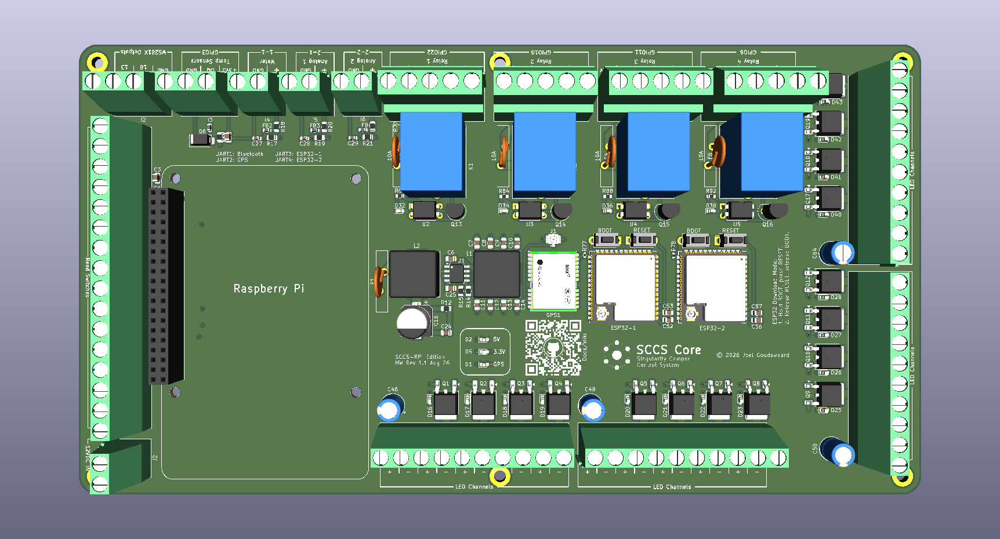</td>
    <td align="center" width="50%">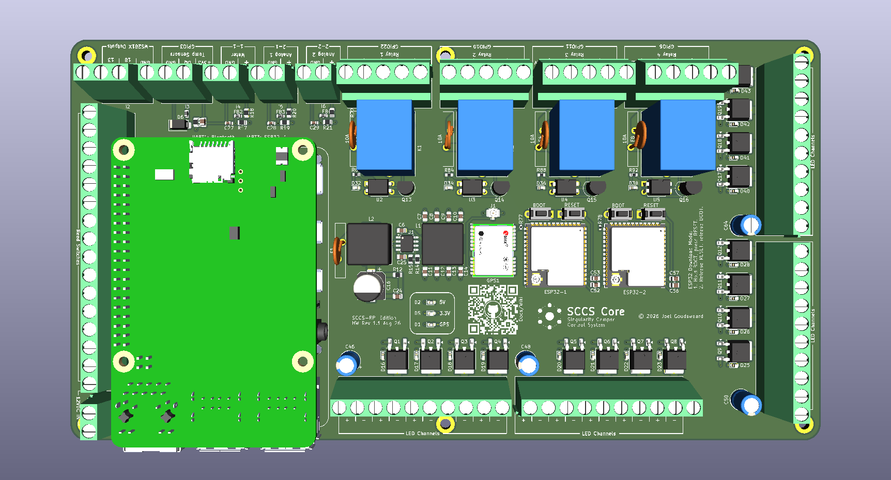</td>
  </tr>
  <tr>
    <td align="center"><strong>Top (bare board)</strong></td>
    <td align="center"><strong>Top (with Raspberry Pi fitted)</strong></td>
  </tr>
  <tr>
    <td align="center">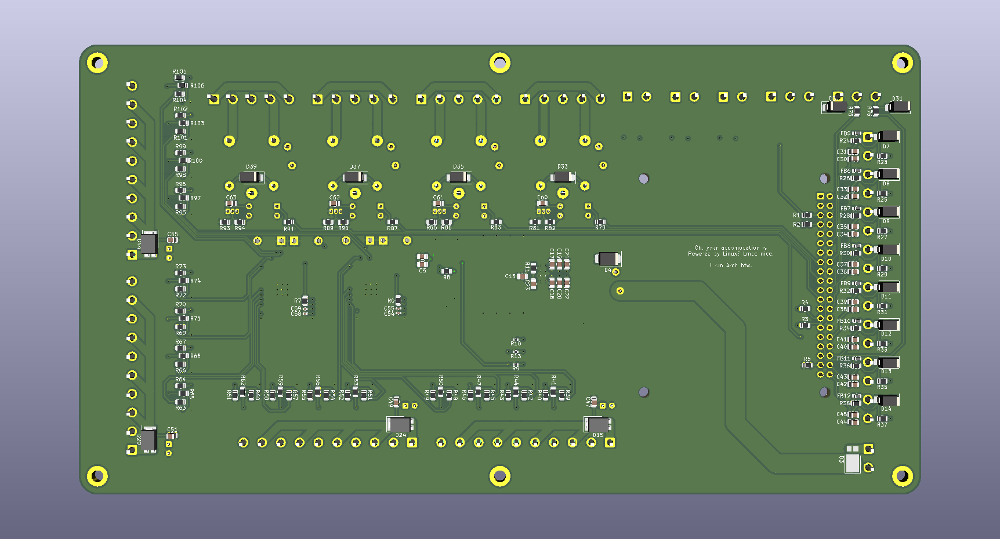</td>
    <td align="center">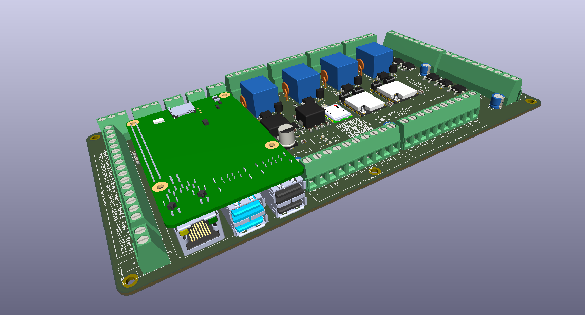</td>
  </tr>
  <tr>
    <td align="center"><strong>Bottom</strong></td>
    <td align="center"><strong>Isometric (with Raspberry Pi fitted)</strong></td>
  </tr>
</table>

### 3D Printable Mount

<table>
  <tr>
    <td align="center" width="50%">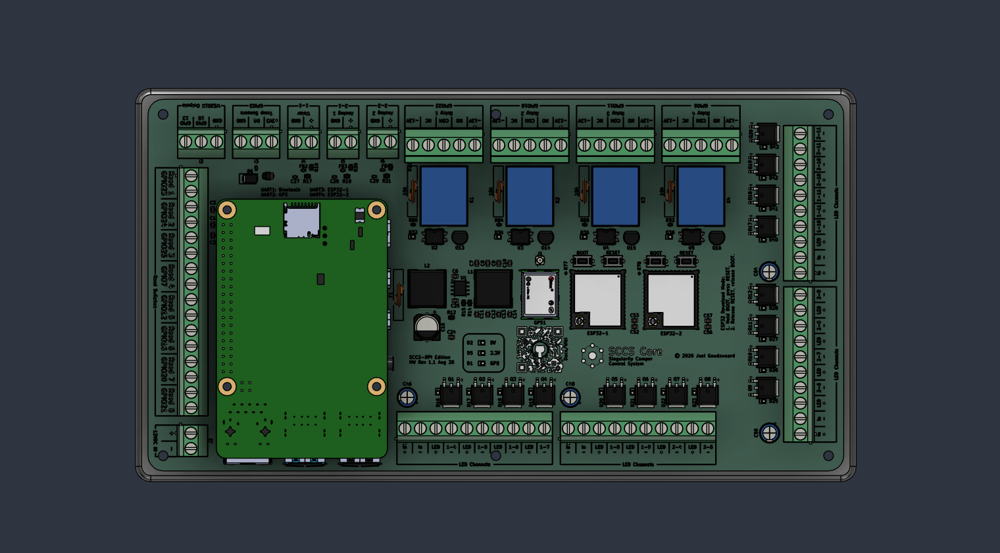</td>
    <td align="center" width="50%">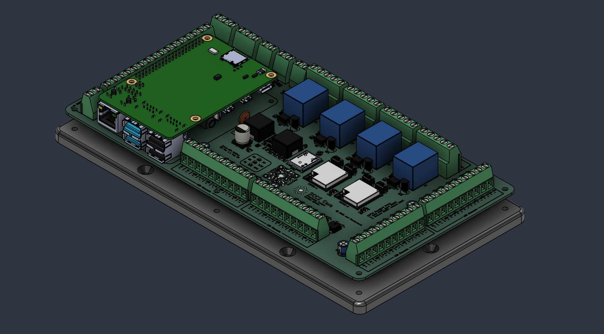</td>
  </tr>
  <tr>
    <td align="center"><strong>3D printable frame (top)</strong></td>
    <td align="center"><strong>3D printable frame (isometric)</strong></td>
  </tr>
</table>

### User Interface

<table>
  <tr>
    <td align="center" width="50%">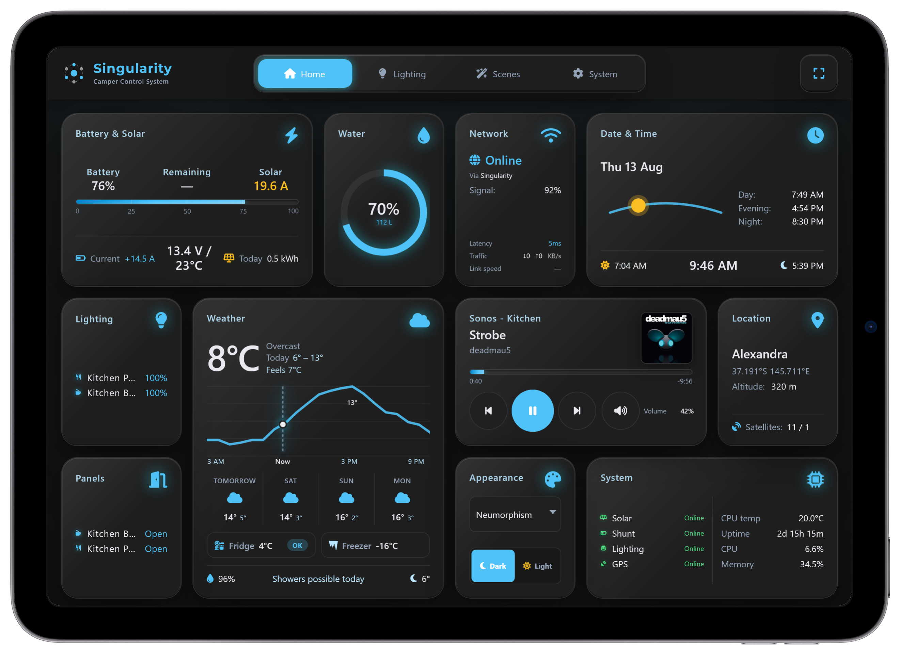</td>
    <td align="center" width="50%">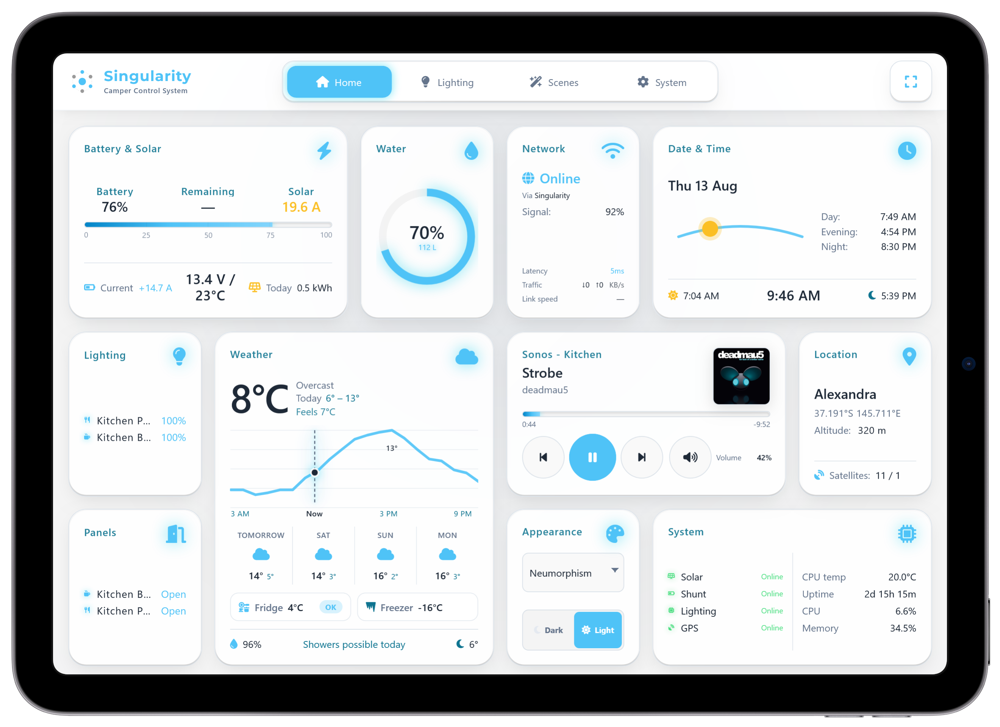</td>
  </tr>
  <tr>
    <td align="center"><strong>Neumorphism (Dark) — iPad</strong></td>
    <td align="center"><strong>Neumorphism (Light) — iPad</strong></td>
  </tr>
  <tr>
    <td align="center">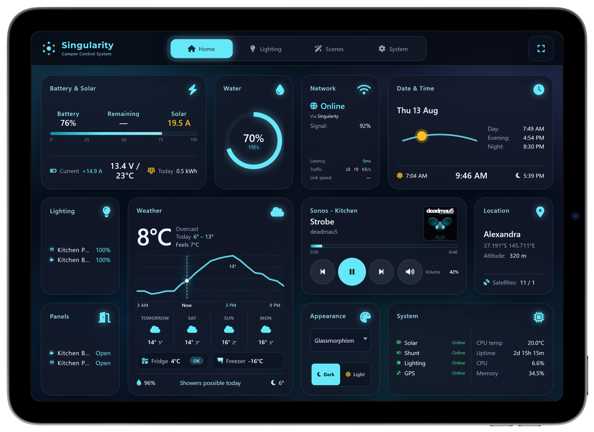</td>
    <td align="center">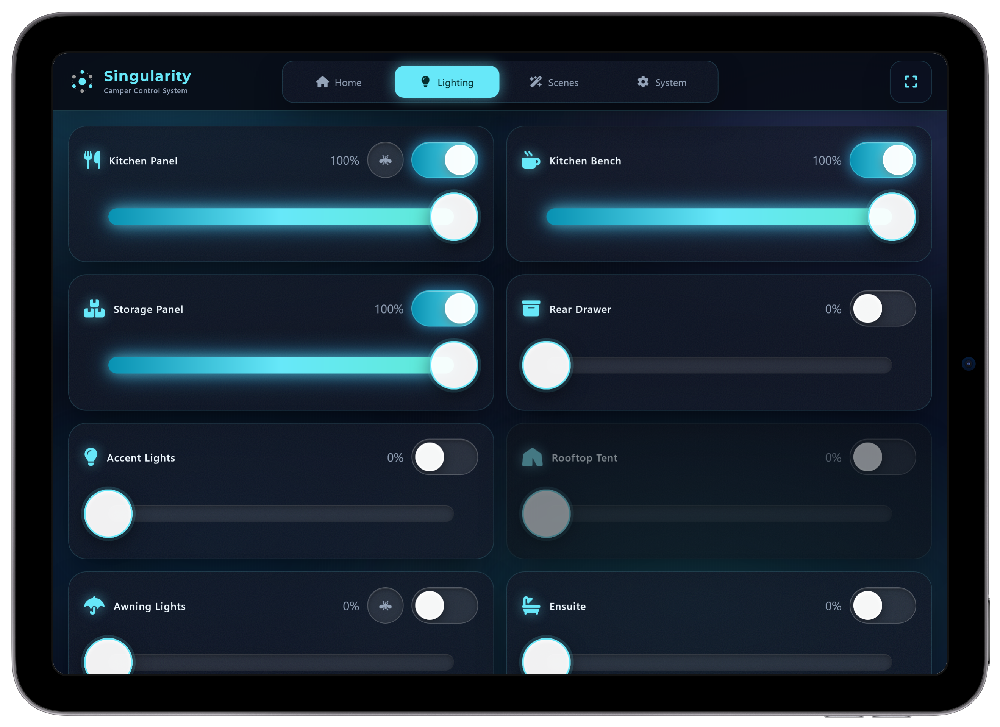</td>
  </tr>
  <tr>
    <td align="center"><strong>Glassmorphism (Dark) — iPad</strong></td>
    <td align="center"><strong>Glassmorphism (Dark) — iPad Lighting</strong></td>
  </tr>
  <tr>
    <td align="center">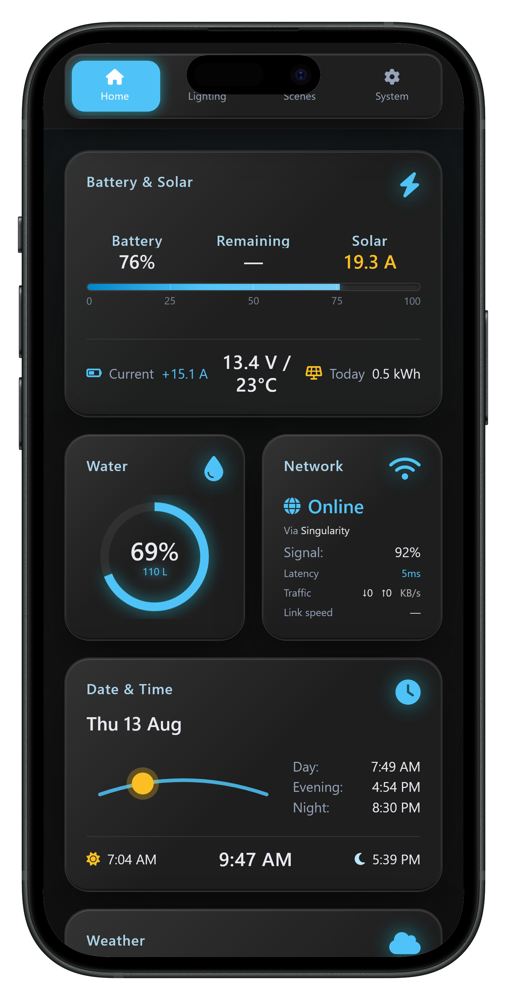</td>
    <td align="center">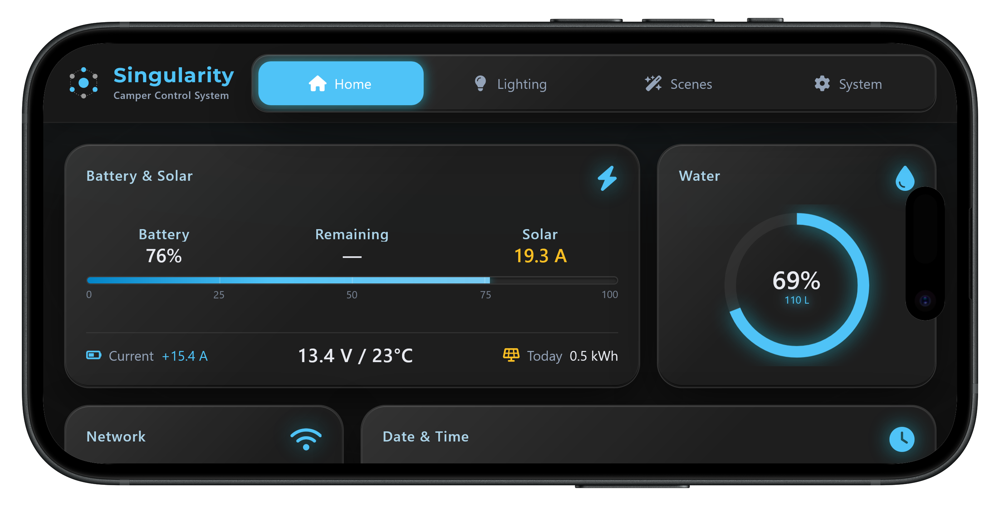</td>
  </tr>
  <tr>
    <td align="center"><strong>Neumorphism (Dark) — iPhone Portrait</strong></td>
    <td align="center"><strong>Neumorphism (Dark) — iPhone Landscape</strong></td>
  </tr>
</table>

---

## Documentation

Wiring, installation, configuration, and optional packages are on the **[project wiki](https://github.com/muntedpissmole/sccs/wiki)** (start at [Home](https://github.com/muntedpissmole/sccs/wiki/Home) for the setup path and glossary).

| Topic | Wiki page |
|-------|-----------|
| Overview, setup path, glossary | [Home](https://github.com/muntedpissmole/sccs/wiki/Home) |
| Shopping list and wiring | [Wiring and Hardware](https://github.com/muntedpissmole/sccs/wiki/Wiring-and-Hardware) |
| Imaging the Pi and installer | [Software Installation](https://github.com/muntedpissmole/sccs/wiki/Software-Installation) |
| `sccs.conf`, phases, lights, sensors | [Software Configuration](https://github.com/muntedpissmole/sccs/wiki/Software-Configuration) |
| SmartShunt / SmartSolar Bluetooth | [Victron Setup](https://github.com/muntedpissmole/sccs/wiki/Victron-Setup) |
| Apple Home app / Siri (optional) | [HomeKit](https://github.com/muntedpissmole/sccs/wiki/HomeKit) |
| Google Home / Gemini (optional) | [Google Home](https://github.com/muntedpissmole/sccs/wiki/Google-Home) |
| LAN, NAT, Pi-hole, USB internet | [Networking](https://github.com/muntedpissmole/sccs/wiki/Networking) |
| UniFi controller (optional) | [UniFi OS Server](https://github.com/muntedpissmole/sccs/wiki/UniFi-OS-Server) |

---

## License

Licensed under the [MIT License](LICENSE).
